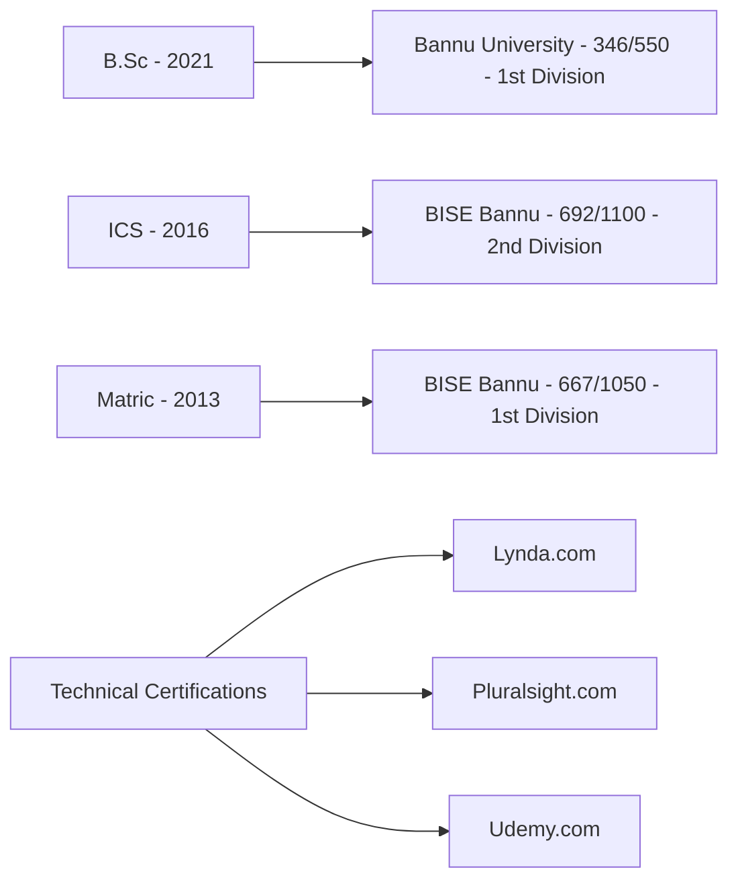

# 🚀 Yasin Ullah | Tech Polymath


## 💫 Tech Innovator \& Full-Stack Developer

> "Building tomorrow's solutions with today's code"

Passionate technologist with deep expertise across multiple domains, seeking to leverage my diverse technical arsenal in an innovative organization that values creativity and technical excellence. My mission is to transform complex business problems into elegant digital solutions while continuously expanding my technological horizons.

```javascript
const yasinProfile = {
  location: "Bannu, Pakistan",
  contact: {
    email: "vking.kahn@gmail.com",
    phone: ["0313-9842219", "0336-1593533"]
  },
  domains: ["Full-Stack Development", "Automation Engineering", "Database Architecture", "UX Design"],
  personalDetails: {
    dob: "March 10, 1998",
    nationality: "Pakistani",
    religion: "Islam",
    maritalStatus: "Married"
  },
  currentFocus: "Developing intelligent automation solutions for enterprise workflows"
};
```


## 🛠️ Technical Arsenal

### 💻 Development

### 🤖 Automation

### 🗃️ Databases

### 🎨 Design

### 🖥️ Office Productivity

## 🎓 Education \& Certifications




## 👨‍💻 Professional Journey

### NADRA NSER BISP | Junior Executive/Focal Person

*3 years, 1 month*

- Managed critical data systems for the Benazir Income Support Program
- Served as a focal point for technical operations and stakeholder communication
- Implemented data integrity protocols and system optimizations


### NADRA | OPL Employee

*8 months*

- Handled data entry and verification processes
- Contributed to the national database management
- Ensured data accuracy and security compliance


### Independent Software Development | Founder

*2 years*

- Established and operated a software development business
- Delivered custom software solutions to diverse business clients
- Managed full project lifecycles from requirements gathering to deployment


### Mikesoft Software Housing | Dynamic Web Developer

*1 year*

- Created interactive web applications with focus on user experience
- Implemented database solutions and optimized backend processes
- Developed custom client-specific web applications


### Khalifa Gul Nawaz Hospital | Website Developer \& Computer Operator

*2 years*

- Designed and maintained the hospital's web presence
- Managed digital infrastructure and IT operations
- Implemented data management systems for patient records


### Zalmai Net Café | Graphic Designer

*4 years (part-time)*

- Created visual assets for marketing campaigns
- Designed print and digital materials for clients
- Utilized Adobe Creative Suite and CorelDRAW for professional designs


## 🧠 Core Competencies

### Technical Prowess

- **Full-Stack Web Development**: End-to-end web solutions with focus on performance
- **Automation Engineering**: Custom scripts for browser and system automation
- **Database Architecture**: Data modeling, query optimization, and system integration
- **UX/UI Design**: User-centered design principles with professional design tools


### Professional Skills

- **Leadership**: Project management and team coordination experience
- **Problem-Solving**: Analytical approach to technical challenges
- **Team Collaboration**: Effective communication in diverse work environments
- **Time Management**: Prioritization and deadline management
- **Adaptability**: Quick learning and adaptation to new technologies


## 🌐 Languages

| Language | Reading | Writing | Speaking | Typing |
| :-- | :--: | :--: | :--: | :--: |
| English | ✓ | ✓ | ✓ | ✓ |
| Urdu | ✓ | ✓ | ✓ | ✓ |
| Pashto | ✓ | ✓ | ✓ | ✓ |
| Arabic | ✓ | ✓ |  | ✓ |

## 📊 GitHub Analytics

## 📫 Connect With Me

<p align="center">
  <a href="mailto:vking.kahn@gmail.com"></a>
  <a href="https://www.linkedin.com/in/yasin-ullah-029229232/"></a>
  <a href="https://x.com/yking_khan"></a>
  <a href="https://github.com/yasinullah"></a>
</p>
<p align="center">
  📱 Phone: 0313-9842219 / 0336-1593533
</p>
<p align="center">
  
</p>

---

<p align="center">
  <i>Address: Village Baker Khel P/O & Tehsil Domel Distt. Bannu, Pakistan</i>
</p>


<div align="center">
  
  <h1>Yasin Ullah 🇵🇰</h1>
  <p>
    <strong>Full-Stack Innovator | Automation Architect | Creative Technologist</strong>
  </p>
  <p>
    📍 Village Baker Khel, Domel, Bannu, Pakistan <br />
    📧 <a href="mailto:vking.kahn@gmail.com">vking.kahn@gmail.com</a> | 📞 +92-313-9842219 / +92-336-1593533
  </p>
</div>

---

## 🚀 About Me

I am a passionate and results-driven **Computer Enthusiast & Software Developer** with a relentless drive for innovation and a deep-seated commitment to lifelong learning. My journey in technology is fueled by a desire to architect and implement solutions that are not only efficient but also transformative. I thrive in dynamic environments where I can leverage my diverse technical skill set to contribute to groundbreaking projects and continuously push the boundaries of what's possible. My objective is to channel my expertise into an organization that values creativity, fosters growth, and dares to shape the future.

---

## 🛠️ My Tech Arsenal & Core Competencies

My expertise spans across a spectrum of technologies, enabling me to tackle complex challenges and deliver end-to-end solutions:

<details>
  <summary><strong>💻 Web Development (Full-Stack)</strong></summary>
  <br />
  <ul>
    <li><strong>Frontend:</strong> HTML5, CSS3, JavaScript (ES6+), AJAX, jQuery, Responsive Design</li>
    <li><strong>Backend:</strong> PHP</li>
    <li><strong>Databases:</strong> MySQL, SQL, Oracle (Forms & Reports), MS Access</li>
    <li><strong>CMS & Frameworks:</strong> WordPress (Expert)</li>
    <li><strong>APIs & Integration:</strong> RESTful APIs, Third-party service integration</li>
  </ul>
</details>

<details>
  <summary><strong>🤖 Automation Engineering</strong></summary>
  <br />
  <ul>
    <li><strong>Browser Automation:</strong> JavaScript (Custom Extensions)</li>
    <li><strong>Desktop & System Automation:</strong> AutoHotkey (AHK), Python (Scripts for task automation)</li>
    <li><strong>Process Optimization:</strong> Identifying and automating repetitive tasks to enhance productivity.</li>
  </ul>
</details>

<details>
  <summary><strong>🗄️ Database Architecture & Management</strong></summary>
  <br />
  <ul>
    <li><strong>Relational Databases:</strong> Proficient in SQL, Oracle (Forms and Reports), MS Access, MySQL.</li>
    <li><strong>Data Modeling:</strong> Designing efficient and scalable database schemas.</li>
    <li><strong>Query Optimization & Data Integrity.</strong></li>
  </ul>
</details>

<details>
  <summary><strong>🎨 Creative Design & UI/UX</strong></summary>
  <br />
  <ul>
    <li><strong>Graphic Design Suites:</strong> Adobe Creative Suite (Photoshop, Illustrator, InDesign, Dreamweaver), CorelDRAW.</li>
    <li><strong>UI/UX Principles:</strong> Crafting intuitive and engaging user interfaces.</li>
    <li><strong>Visual Communication & Branding.</strong></li>
  </ul>
</details>

<details>
  <summary><strong>⚙️ Productivity & Operational Suite</strong></summary>
  <br />
  <ul>
    <li><strong>MS Office Suite:</strong> Advanced proficiency in Word, Excel, PowerPoint, Access, MS Project.</li>
    <li><strong>Data Entry & Management:</strong> High accuracy and efficiency.</li>
  </ul>
</details>

---

## 🌌 Professional Journey & Impact Highlights

My career is a testament to versatility and a commitment to delivering excellence across diverse roles:

*   🌟 **Founder & Lead Developer @ My Own Software House (2 Years)**
    *   Architected and delivered bespoke software solutions, web applications, and automation scripts for diverse business clients.
    *   Managed full project lifecycles from ideation and requirement gathering to deployment and post-launch support.
    *   Pioneered innovative approaches to solve client challenges, enhancing their operational efficiency.

*   🚀 **Dynamic Web Developer @ Mikesoft Software Housing, Bannu (1 Year)**
    *   Engineered robust and scalable web applications, focusing on dynamic content and user interaction.
    *   Collaborated in an agile environment to rapidly iterate and deploy features.

*   🏥 **Website Developer & Computer Operator @ Khalifa Gul Nawaz Hospital (2 Years)**
    *   Developed and maintained the hospital's web presence, improving information accessibility.
    *   Managed IT operations, providing critical support and ensuring system uptime.

*   🏛️ **Junior Executive / Focal Person @ NADRA NSER BISP (3 Years, 1 Month)**
    *   Spearheaded project coordination and data management for a critical national socio-economic program.
    *   Leveraged technical skills for data analysis, reporting, and ensuring operational integrity.
    *   Served as a key liaison, demonstrating strong communication and leadership capabilities.

*   🏢 **OPL Employee @ NADRA (8 Months)**
    *   Contributed to national database operations, ensuring data accuracy and security.

*   🎨 **Graphic Design Virtuoso (Part-Time) @ Zalmai Net Café (4 Years)**
    *   Crafted compelling visual designs and marketing materials using Photoshop, Illustrator, and CorelDRAW.

---

## 💡 Continuous Evolution & Certifications

I am a firm believer in the power of continuous learning to stay at the vanguard of technological advancements. My skills are sharpened and validated through extensive coursework and certifications from globally recognized platforms:

*   **Lynda.com (now LinkedIn Learning)**
*   **Pluralsight.com**
*   **Udemy.com**

*(Actively pursuing new skills in areas like Cloud Computing, AI/ML fundamentals, and advanced JavaScript frameworks.)*

---

## 🤝 The Human Element: Soft Skills

Beyond the code and algorithms, I bring a suite of soft skills crucial for collaborative success:

*   **Leadership & Initiative:** Proven through entrepreneurial ventures and managing key responsibilities in government projects.
*   **Strategic Problem-Solving:** Adept at dissecting complex issues and engineering innovative, effective solutions.
*   **Agile Collaboration:** Seamlessly integrate with teams, fostering a positive and productive work environment.
*   **Effective Time Management:** Juggling multiple projects and stringent deadlines with precision and efficiency.
*   **Adaptability & Resilience:** Thriving in diverse and challenging environments, from startups to large government bodies.
*   **Stellar Communication:** Articulating technical concepts clearly to both technical and non-technical audiences.

---

## 🎓 Academic Foundation

*   **B.Sc** - Bannu University (2021) - *1st Division*
*   **ICS** - BISE Bannu (2016) - *2nd Division*
*   **Matric** - BISE Bannu (2013) - *1st Division*

---

## 🌐 Languages

*   **English:** Fluent (Read, Write, Speak, Type)
*   **Urdu:** Native (Read, Write, Speak, Type)
*   **Pashto:** Native (Read, Write, Speak, Type)
*   **Arabic:** Proficient (Read, Write, Type)

---

## ✨ Let's Build the Future Together!

I'm always excited to connect with fellow innovators, explore new challenges, and collaborate on projects that make a difference. Feel free to reach out via email!

<div align="center">
  <p>
     Yasin Ullah | All Rights Reserved
  </p>
</div>
